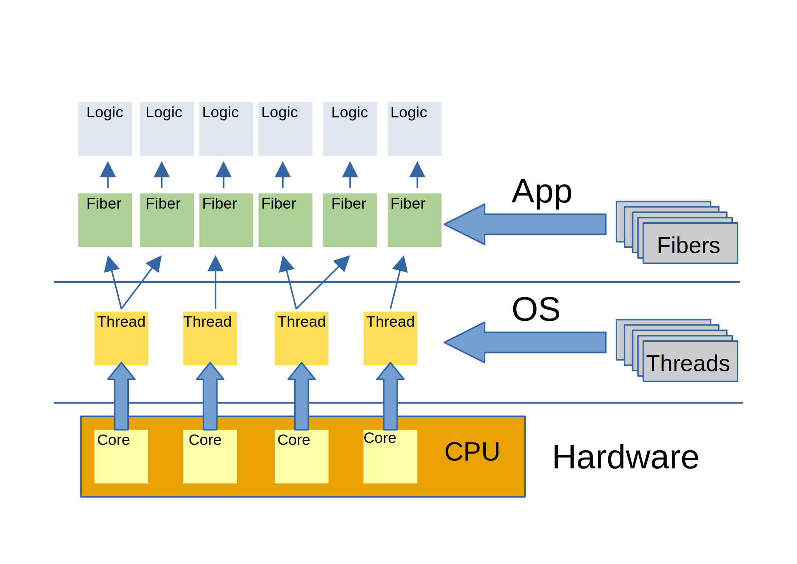

## ZIO
## Асинхронность и многопоточность
## Управление ресурсами


<br>
<br>
Роман Деньгин

---
### Разница на примере задачи

* Вам нужно выкопать во дворе бассейн

* Вы взяли лопату и копаете. Это однопоточная работа

---


---

### Параллельное исполнение

* Параллельное исполнение подразумевает наличие <span class="naumen">более одного</span> вычислительного устройства (например, процессора), которые будут <span class="naumen">одновременно</span> выполнять несколько задач

---
### Параллельное исполнение

#### Пример
* Пока вы копаете бассейн, Вася копает канаву под водопровод. Никто никому не мешает. Это параллельное исполнение

---
### Конкуретное исполнение
* Это один из способов реализации исполнения путем выделения абстракции "рабочего потока" (worker thread)

---
### Конкурентное исполнение
#### Пример
* Вы пригласили друга Васю и копаете вместе, периодически задевая друг-друга лопатами

---
### Асинхронность
* Подразумевает, что операция может быть выполнена кем-то на стороне: удаленным веб-узлом, сервером или другим устройством за пределами текущего вычислительного устройства

---
### Асинхронность
#### Пример
* Вы пригласили бригаду землекопов, а сами отдыхаете. Когда бригада все сделает, к вам придут за деньгами. Это асинхронная работа

---
### Базовые возможности concurrency в Scala

---
### Future

> Futures provide a way to reason about performing many operations in parallel – in an efficient and non-blocking way.

(c) documentation

---
### Future

* Неблокирующие, используют callback'и
* Цепочку Future'ов можно комбинировать через map/flatMap

```scala
val getTopAuthors: Future[Seq[Author]] = for {
    books: Seq[Book]      <- bookService.getTop10()
    authorIds: Seq[String] = books.map(_.authorId)
    authors: Seq[Author]  <- authorService.getByIds(authorIds)
} yield {
    authors
}
```

---
#### Execution Context
* Future запускается в рамках контекста исполнения
* Вычисления выполняются в новом потоке, в потоке из пула или в текущем
* Существует фиксированный глобальный контекст - используется по умолчанию
* Можно создавать свои контексты исполнения со своими пулами потоков

---
### Параллельная обработка коллекций
```scala
val lst = someList()

lst.map(hardElementOperation(_))
lst.par.map(hardElementOperation(_))
```

---
### Overhead при работе с потоками
1. Выделение потока дорогостоящая операция
1. Содержание потока ресурсоёмко
1. Переключеие между потоками занимает время
1. Отсутствие возможности композиции

---
### Green threads - альтернатива классическим потокам
* Управляет ВМ, а не система
* Управление происходит в пространстве пользователя, а не ядра
* Значительно превосходят встроенные потоки Linux-системы по времени активации потоков и синхронизации

---
### ZIO Fibers

* Можно рассматривать как <span class="naumen">виртуальный</span> поток
* Аналог java.lang.Thread, но <span class="naumen">производительнее</span>
* <span class="naumen">Один поток JVM</span> будет исполнять <span class="naumen">несколько файберов</span>

---



---
### ZIO Fibers преимущества
* Неограниченное к-во потоков
* Легковесность
* Возможность компоновки
* Безопасное прерывание потока
* Иерархия потоков

---

### ZIO Fibers. Типы данных
1. `Fiber` - сам виртуальный поток
1. `Fiber.Status` - текущее состояние потока
1. `FiberId` - уникальный идентификатор потока

---


### ZIO Fibers. Пример

```scala
private def boilWater(): ZIO[Any, Nothing, Unit] = {...}
private def fryEggs(): ZIO[Any, Nothing, Unit] = {...}

def makeBreakfast: ZIO[Any, Nothing, Unit] = for {
    waterFiber <- boilWater()
    eggsFiber <- fryEggs()
} yield ()
```

---

### ZIO Fibers. Пример

```scala
private def boilWater(): ZIO[Any, Nothing, Unit] = {...}
private def fryEggs(): ZIO[Any, Nothing, Unit] = {...}

def makeBreakfast: ZIO[Any, Nothing, Unit] = for {
    waterFiber <- boilWater().fork
    eggsFiber <- fryEggs().fork
} yield ()
```

---

### ZIO Fibers. Пример

```scala
private def boilWater(): ZIO[Any, Nothing, Unit] = {...}
private def fryEggs(): ZIO[Any, Nothing, Unit] = {...}

def makeBreakfast: ZIO[Any, Nothing, Unit] = for {
    waterFiber <- boilWater().fork
    eggsFiber <- fryEggs().fork
    _ <- waterFiber.zip(eggsFiber).await
} yield ()

```

---
### ZIO Fibers. Основные функции
* fork
* forkDaemon
* await
* join
* interrupt

---
### ZIO to Fibers
* race
* zipPar
* foreachPar
* reduceAllPar

---
### ZIO Fibers. Прерывание потока
#### Причины

* Нет необхоидмости дожидаться поток (например, нужен результат только того, кто завершился вперед)
* Прерывать при превышении определенного времени выполнения
* Отмета выполнения пользователем (интерактивные приложения)

---
### ZIO Fibers. Прерывание потока
#### Способы
* Полуасинхронное прерывание (опрос для прерывания) - поток сам периодечески проверяет, нет ли ему команды на остановку
* Асинхронное прерывание — поток позволяет прервать другой поток

---
### ZIO Fibers. Прерывание потока
#### Fiber#interrupt
```scala
def task = for {
    fn <- ZIO.fiberId.map(_.threadName)
    _ <- ZIO.debug(s"$fn starts a long running task")
    _ <- ZIO.sleep(1.minute)
    _ <- ZIO.debug("done!")
} yield ()

def run = for {
    f <- task
        .onInterrupt(ZIO.debug(s"Task interrupted while running"))
        .fork
    _ <- f.interrupt
} yield ()
```

---
### ZIO Fibers. Прерывание потока
#### Прерывание блокирующих операций
```scala
for {
  fiber <- ZIO.attemptBlocking {
    while (true) {
      Thread.sleep(1000)
      println("Doing some blocking operation")
    }
  }.ensuring(
    Console.printLine("End of a blocking operation").orDie
  ).fork

  _ <- fiber.interrupt.schedule(
    Schedule.delayed(
      Schedule.duration(1.seconds)
    )
  )
} yield ()
```

---
### ZIO Ресурсы, ZManaged
`ZManaged[R, E, A]` - это управляемый ресурс, который требует `R` и может завершиться сбоем с `E` значением или завершиться успешно с `A`

---
### ZIO Ресурсы, ZManaged

Это структура данных, которая инкапсулирует получение и высвобождение ресурса, который может быть использован путем вызова метода `use` ресурса. Ресурс будет автоматически захвачен до использования и автоматически освобожден после использования

---
### ZIO Ресурсы, ZManaged

```scala
val managed = ZManaged.make(acquire)(release)
```

---
### ZIO Ресурсы, ZManaged

```scala
def printFirstLine(file: String): ZIO[Console, Throwable, Unit] = {

  def acquire(file: String) = ZIO.effect(
    new BufferedReader(new FileReader(file))
  )

  def release(reader: BufferedReader) =
    ZIO.effectTotal(reader.close())

  ZManaged.make(acquire(file))(release).use { reader =>
    putStrLn(reader.readLine()) 
  }
}
```

---
### ZIO Ресурсы, ZManaged
Каждый ZIO эффект может быть преобразован к `ZManaged` с помощью `ZManaged.fromEffect` или `ZIO#toZManaged_`

```scala
val managedHello = ZManaged.fromEffect(putStrLn("Hello, World!"))
val managedHello_ = putStrLn("Hello, World!").toManaged_
```

---
### ZIO Ресурсы, ZManaged
Если ресурс реализовал AutoClosable интерфейс, мы можем легко создать ZManaged из него, используя ZManaged.fromAutoClosable конструктор:

```scala
ZManaged.fromAutoCloseable(ZIO.effect(
    new FileInputStream("file.txt")
))

ZManaged.fromAutoCloseable(ZIO.effect(
    fromResource("file.txt")
))

ZManaged.fromAutoCloseable(ZIO.effect(
    fromFile("file.txt")
))
```

---
### ZIO Ресурсы, ZManaged
#### Применение 
```scala
def firstLine(file: String): ZIO[Console, Throwable, Unit] =
  ZManaged
    .fromAutoCloseable(ZIO.effect(fromFile(file)))
    .use { reader =>
      putStrLn(reader.bufferedReader().readLine())
    }
```

---

### ZIO Ресурсы, ZManaged
#### Применение 

Если наш управляемый ресурс может быть действительным после освобождения ресурсов, мы можем преобразовать этот ZManaged в ZIO эффект, вызвав ZManaged#useNow

---
### ZIO Ресурсы, ZManaged
#### Применение 

Предположим, мы собираемся сделать управляемый ресурс долгоживущим. ZManaged#useForever преобразует ZManaged в ZIO эффект, который будет доступен вечно

---


### ZIO Ресурсы, ZManaged
#### Комбинаторы

* ensuringFirst - добавляет дополнительный финализатор перед основным
* onExitFirst - похож на ensuringFirst, но имеет доступ к результату

---
### ZIO Ресурсы, ZManaged
#### Комбинаторы

* withEarlyRelease - создает новый ZManaged с возможностью бытсрого вызова основного финализатора
* withEarlyReleaseExit - похож на withEarlyRelease, но позволяет указать выходное значение

---

### Спасибо за внимание!

### Вопросы?
